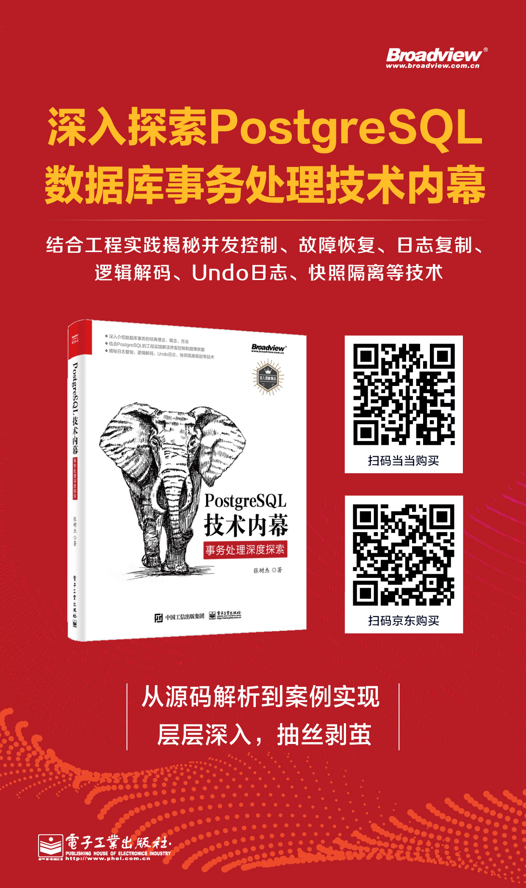

[京东地址](https://item.jd.com/12898593.html)  
[当当地址](http://product.dangdang.com/29277465.html)  
[淘宝地址](https://detail.tmall.com/item.htm?spm=a1z10.3-b-s.w4011-22119638442.37.798d1b8b6TlJDS&id=651820819927&rn=215b8c029b06d654c30a5777273c979e&abbucket=1) 

 

几十年来，国外数据库巨头凭借先发优势形成的技术壁垒和理论壁垒垄断了数据库市场，卡住了中国乃至世界的脖子，《科技日报》曾推出系列文章报道制约我国工业发展的35项“卡脖子”技术，数据库管理系统就是其中的一项。虽然国产数据库近些年蓬勃发展，但只能在在周边领域打转，在金融关键核心系统上则屡败屡战，未尝一胜。

**这其中的关键原因不难理解：技术不行。**

 
<!--more-->
 
数据库的两个关键指标是**“快”**和**“稳”**。其中“快”由优化器负责，它通过对用户输入查询进行代数优化、代价优化从而选择多快好省的执行路径；而“稳”则主要由事务负责，它通过并发控制和故障恢复理论保证数据库在执行的过程中满足原子性、一致性、隔离性、持久性，保证数据的不错不丢。

无论是查询优化技术，还是事务处理技术，国产数据库和国外数据库巨头之间都有不小的差距，现在仍处于模仿中的技术创新阶段，少有真正原创的核心技术。一方面，随着云计算、大数据、互联网金融等信息技术的不断发展，对数据库等基础核心软件的要求越来越高，另一方面，国产数据库则后劲乏力、缺乏积极进取的精神，虽落后于世界但仍沾沾自喜。

因此，当前数据库发展的主要矛盾就变成：**核心应用软件对数据库日益提高的性能、稳定、安全的需求和落后的国产数据库技术之间的矛盾。**

2019年始，以美国为首的一些发达国家开始了对中国发展的围追堵截，中华民族又到了最危险的时候，此诚危急存亡之秋也。作为数据库的从业者自然也应该肩负责任、奋发图强、迎头赶上，撸起袖子加油干。

PostgreSQL数据库作为世界上最先进的开源数据库，秉承了开源的开放奉献、追求进步的精神，不受控于任何公司、国家，是我们良师益友，全面的掌握PostgreSQL则有助于我们的发展和进步。

2018年，电子工业出版社出版了《PostgreSQL技术内幕：查询优化深度探索》一书，已经对数据库中的“快”技术做了深度的剖析，帮助大量的数据库爱好者更深入的了解了数据库查询优化器的技术实现方法，让很多人对优化器有了更深层次的了解。

2021年，应对数据库“稳”技术的《PostgreSQL技术内幕：事务处理深度探索》也将上市，为数据库的从业者提供充分的补给。本书分析了PostgreSQL数据库事务的实现机制，包括事务的基本概念、两阶段锁的原理及实现方法、多版本并发控制的原理及实现方法、故障恢复的实现方法等，然后通过介绍物理复制、逻辑复制、Zheap引擎的原理及实现、SSI的实现、两阶段提交的原理及实现增强读者对事务更深入的理解，从而使读者既能了解事务的原理，也能清楚事务的实现细节。

相信《PostgreSQL技术内幕》系列丛书能够抛砖引玉，让越来越多的中华儿女投身到数据库内核事业中来，让越来越多的数据库从业者分享出自己的心得和理解，让越来越多的国产数据库能够屹立于世界之林。

**男儿不展风云志，空负天生八尺躯，数据库从业者们，奋斗吧。**
