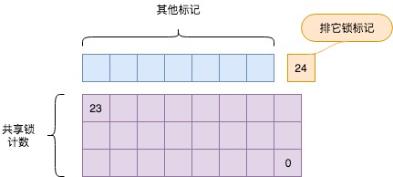
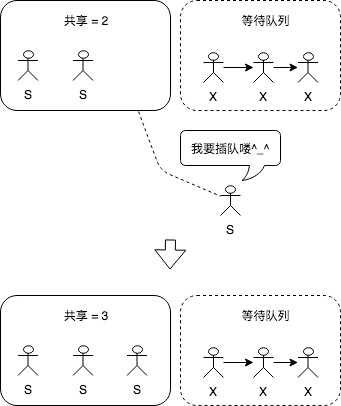
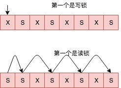

大明与小明聊完了自旋锁，已是中午时分，大明突然想到最近有一本讲解事务处理的新书要上市，正好包含要讲给小明的自旋锁、轻量锁、常规锁等内容，于是对小明说：“最近上市了一本新书，叫**《PostgreSQL技术内幕：事务处理深度探索》**，是**《PostgreSQL技术内幕：查询优化深度探索》**的姊妹篇，恰好有你想要学习的内容，我们不妨去附近的书店看看。”

经过一上午的讲解，小明已经精疲力尽，腹中隆隆作响，大明不由笑道：“咱们还是先饱餐战饭，然后再去书店吧。”

小明揉揉肚子，确实已经是饥肠辘辘，便笑道：”免不了又让你破费。“

<!--more-->

大明从沙发上弹起身子，边穿外衣边道：”附近美食颇多，沙县料理、成都七星酒店都不错，我们还是边走边看吧。“

大明家附近不远恰有一条商业街，周末时间的中午，商业街上熙熙攘攘，人流穿梭，附近的酒店竟然纷纷排起队来，还有一些酒店已经被婚礼包场，加长的婚车路过商业街，自是热闹非常。大明和小明先是来到沙县料理，发现已被婚礼包场，然后又到了成都七星酒店，结果店外排队等候的宾客自觉地排起了一条长龙，不免有些扫兴。

大明提议道：”我知道此处角落有一家小吃，店家虽小，但味道不错，不如前去一试。“于是二人穿梭进商业街角落的一个小巷，七拐八拐，终于来到一家小店门前，店面虽小，但看上去整洁干净，装修古朴，大大的招牌上写着鎏金的的店名：老约翰炸酱面馆。不过店面在商业街外的角落中，店中的客人不多，仍有余位，二人便找了一个不错的位置坐下了。

小明拿起菜单笑道：”没想到这小小的角落中竟卧虎藏龙，不如就吃他们这里的招牌套餐，炸酱意大利面吧，我要一个大碗的。”大明于是对服务员说：“要两个大碗的炸酱意大利面，给我拿两头蒜。”

然后大明转头对小明说道：“今天真是触霉头，好点的饭店竟然都被婚礼给独占了。”小明便说：“没关系，自旋锁嘛，都是互斥的，他们占了，我们就进不去，不过我们就不等了，直接换一家吃，我看炸酱意大利面也不错。”

大明说道：“说到这里，我们不妨再介绍一下PostgreSQL中的轻量锁，这是一种有共享精神的锁。”

”轻量锁？让我想想，我好想听说过这种类型的锁，它和自旋锁不同，它一般用于保护PostgreSQL中对共享内存的操作吧，它是一种读写锁吧？“

**读写锁**

”是的。“大明边点头便说：”轻量锁把锁分成了读锁和写锁，读锁只读取访问资源，因此是可以共享的，也就是说可以有多个进程同时读共享资源，而写锁则是排它的，因为写锁的持有者要修改共享资源中的内容，它的锁相容矩阵是这样的。“说着，大明蘸了点茶水，在桌面上画出了轻量锁的相容矩阵。

| 锁类型   | 读锁     |  写锁    |
| ------- | -----:  | :----: |
| 读锁     | O      |   X    |
| 写锁     | X      |   X    |

"你看，这其中O就代表相容，X就代表互斥。"大明边画边说。
小明看着桌面上渐渐淡去的水痕，若有所思的说道：”这种锁的出现就是为了提高并发度，因为读和读是相容的。它和自旋锁是的不同在于，自旋锁是互斥锁，一旦锁定了临界区，其他访问者就只能等了。它是没有等级概念的，就只有互斥一种情况，而轻量锁把对共享资源的访问划分成了2个等级，一个等级是读，一个等级是写，这样锁的粒度就更细了。”

大明点了点头说道：“说得好，但我们还是尽量不要把轻量锁和自旋锁混为一谈，它们的目的不同，实际上在早期的PostgreSQL中，轻量锁是借助自旋锁实现的。”

小明惊奇道：“借助自旋锁实现的?”

“嗯，我们在实现自旋锁的时候，借助CPU提供的原语实现了对一个共享变量的原子操作，所以我们就可以根据这个共享变量的状态来决定我们是不是可以进入临界区。”大明停顿了一下，然后继续说：“轻量锁的实现也无外乎如此，只不过它的状态多了，用一个变量不好保存，于是就用自旋锁来实现对这些变量的保护。”

小明点点头说道：“嗯，在讲解自旋锁的时候你曾经说过，自旋锁一般只保护很小的临界区，所以可以忙等，也就是说用自旋锁来实现轻量锁的时候，保护共享状态的临界区也一定非常小，不然就没有办法用自旋锁来实现轻量锁了吧。”

**事情发生了变化**

大明皱了皱眉说道：“是的，也正因为如此，事情已经发生变化，我们以前可以说PostgreSQL用自旋锁来实现了轻量锁，但是现在不能这么说了。”

“为什么？”

“在之前的PostgreSQL版本中，轻量锁的锁结构中有几个变量用来记录当前锁的状态，比如，共享锁可以由多个访问者共享，我们就可以用一个变量来记录目前有多少个访问者共享这个锁，比如排它锁具有互斥性，我们就采用一个变量来标识当前谁获得了排它锁。最终根据这些状态就可以判断新的访问者是否可以获得锁，但这里有两个问题。”大明停顿了一下，继续说道：“一个问题是轻量锁的获取和释放特别频繁，另一个问题是这次自旋锁保护的临界区有点大了，把这两个问题综合到一起就是：这里用自旋锁保护临界区，降低了PostgreSQL的性能。”

“我听你刚才说的，好像是有点浪费，比如排它锁的状态吧，我们只需要一个0和1的状态就可以了，用一个字节来标识都嫌多，而共享锁的计数我想也不会达到2^32次方，所以用一个4字节的int来表示，也完全是一种浪费，我看可以把这些状态用bit位来标识，完全就可以了。”小明略有所思的说道。

大明赞赏的说：“完全正确。”

这时候服务员把炸酱意大利面已经端上来了，两个人顾不上再接着说轻量锁，开始吃起来，小明一边吃一边想怎么合理的分配轻量锁状态的bit位，对于排它锁而言，只需要一个bit就够了，而共享锁的计数呢？需要分配多少个呢？

大明快速的吃了几口面，然后用蘸着水在桌子上画了起来：“目前轻量锁状态的布局是这样的。”

 

小明赞许的说：“嗯，用24个bit位做计数，应该是够多了。现在都喜欢用无锁编程，那么这么一个变量的保护也就没有必要再使用自旋锁来保护了，只要自己实现一个CAS的原语就够了。”

“对，正是这样实现的，这样就解决了并发的问题。”

**保护的也不大**

小明想了想，继续说道：“那既然已经不用自旋锁实现轻量锁了，那自旋锁是不是就快要退休了呢？”

大明啃了一口大蒜然后说道：“或许吧，但目前自旋锁还是有些用处的，现在说要退休还为时尚早。而轻量锁呢，也有它自己的问题，它之所以叫轻量锁，原因就是它也期望自己保护的临界区不太‘大’，虽然未必如自旋锁那样，只需要很少的CPU时钟周期，但如果轻量锁保护的临界区太复杂，仍然可能带来性能问题。我就曾经犯过一个错误，在轻量锁保护的临界区中加入了太多的新代码，最终导致数据库连接不上。。。”

“可是，轻量锁中不是有读锁吗，那还不够吗？”

“PostgreSQL中写共享内存状态的情况也不少，因此并不是把锁的状态分离成两个等级之后就能解决一切问题，写-写之间、写-读之间仍然是互斥的，所以使用轻量锁的时候仍然要谨记，轻量锁保护的区间不能太大。这就好像旅游区的公厕一样，虽然你独占了马桶，但是请快速解决问题，不然外边的等待队列太长，也会造成拥堵。”

听大明说起了旅游区的马桶，小明顿时觉得口中的面难以下咽，于是问道："嗯？轻量锁还会排队，看来这和自旋锁不一样，自旋锁好像没有等待队列嗳？"

**等待队列**

大明吃了一口面继续说道：“嗯，确实是这样，自旋锁是没有队列的，但是轻量锁有等待队列。比如，现在有进程已经以共享状态持有了一个轻量锁，那么想要持有互斥锁的进程肯定是只能进等待队列了。”

“如果这时候又来一个进程想要持有共享锁呢？是讲究先来后到的进入等待队列，还是直接获得共享锁？”

“嗯，好问题，这就是轻量锁和常规锁的不同。”

“常规锁？”

“就是表级锁啊，轻量锁在这种情况下，共享锁就可以直接获取了，但是常规锁可能就需要进等待队列喽！”

 

**唤醒**

这时店外进来一个高大的身影，胡茬唏嘘，格子衬衣，小明远远看去似曾相识，于是向大明问道：“那刚进来的人可是牛二哥？”大明转头一看，果然是牛二哥，于是起身招呼道：“老牛，你怎么也到这里才吃面了，过来我们同坐一桌吧。”牛二哥看是大明和小明，非常高兴，于是像小明问道：“小兄弟，上次我和大明给你讲的查询优化你还记得吧？”

小明忙说：“记得记得，我现在已经获得了我们宿舍的‘优化器小能手’称号，我明天就去买个奖状挂起来。不过今天大明哥正给我讲轻量锁呢，牛二哥来吧，咱们3个都是申请读锁的，可以同坐一桌。”

牛二哥笑着坐在小明旁边，对服务员说：“给我一碗刀削意大利面。”然后转过头说：“我刚才在商业街转了几个圈，一个空位都没找到，就想起来这里有个面馆，于是就过来了。”

小明说：“嗯，看来还是轻量锁好，读锁可以相容，不像自旋锁，自己占着CPU原地打转。”小明一边说一边用手在桌上画了几个圈。

牛二哥说：“嗯，不过我们这些读锁已经占领了这个桌子，如果有写锁想来独占，也需要等我们走了才行，我们和他们不相容啊。”
小明想了想顿时领悟，如果此时有人以读锁申请轻量锁，而我们申请的也是读锁，自然是可以直接获得锁的，而如果我们申请的是写锁，那么就肯定只能等待了。但是如果现在有人以写锁持有轻量锁，那么无论是新来的读锁还是写锁，都需要进入等待队列，想到此处小明不禁发问道：“那如果持有锁的人释放了锁，我们应该以什么顺序唤醒等待队列里的锁呢？”

牛二哥想了想，说：“嗯，那要看排在第一个的是什么锁，如果排在第一个的是写锁，那么就直接唤醒这个写锁，如果排在第一个的是读锁，那么就唤醒等待队列中所有的读锁，而忽略等待队列中的写锁，就像这样。。。”说着，牛二哥在桌上画了起来。

 

**小结**

看着牛二哥在桌上的等待队列唤醒图，小明觉得应该对轻量锁有了一个基本的了解，但是突然萌发了一个想法：刚才大明说过常规锁，那又是怎样实现的呢？于是便问牛二哥：“那常规锁有没有等待队列？”牛二哥愣了一下，突然大笑道：“不急不急，最近有本新书《PostgreSQL技术内幕：事务处理深度探索》已经上市了，里面啥都有，我们吃完去书店看看吧。”
大明和小明点头道：“正有此意，同去同去。”

这时服务员把牛二哥的面已经端上来了，于是三个人又开始边吃边聊一些业内的八卦，老约翰炸酱面馆中又恢复了活泼的气氛。
