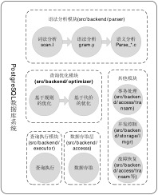
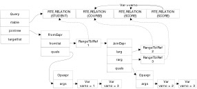

通过大明给小明解释了查询优化器的基本原理，小明在学校的数据库原理课堂上顺风顺水，每天吃饭睡觉打豆豆，日子过得非常悠哉，不过眼看就到了数据库原理的实践课了，老师给出的题目是分析一个数据库的某一模块的实现，小明千挑万选，终于选定了要分析PostgreSQL数据库的查询优化器的实现，因为据说PostgreSQL数据库的查询优化器层（相）次（当）清（复）楚（杂），具有教科书级的示范作用。<!-- more -->
	
可是当小明下载了PostgreSQL数据库的源代码，顿时就懵圈了，虽然平时理论说的天花乱坠，但是到了实践的时候却发现，理论和实际对应不上，小明深深的陷入到代码的细节里面不可自拔，小明查阅了好多资料，结果是读破书万卷，下笔如有锤，一点进展就没有。于是小明又想到了自己的哥哥——大明，他作为Greenplum/HAWQ数据库的资深的数据库内核老码农，不是和PostgreSQL数据库有着不解之缘吗？想必他一定能站得更高，看的更远，于是小明蹬着自己的宝马向大明驶去。
	
大明接到了小明要来“视察”的消息，早就做好了准备，大明也只是在工作中偶尔接触一下优化器，也没有对查询优化器有多熟悉，正好借着这次机会自己也对优化器进行了一番学习。看着小明大汗淋漓的走进了门，大明从冰箱里拿了一根从菜市场买的巧牙兹，意味深长的说：“小明同学，PostgreSQL数据库的查询优化器功能比较多，恐怕一次说不完，我们把它分成几次来说清楚吧。”

小明虽然感觉冰棍的味道有点偏差，但觉得大明说得有道理，因为自己通过查看PostgreSQL数据库的源码的确非常复杂，于是说：“的确是的，我在看查询优化器代码的时候，觉得无从下手，虽然查询优化的一些理论我学过了，但是不知道代码和理论如何对应，而且还有一些优化规则好像我们讲数据库原理的时候也没有涉及到，毕竟理论和实践之间还有一些差距。”

大明打开电脑，调出了PostgreSQL的代码，然后说：“我们先来看一下PostgreSQL数据库一个查询执行的基本流程。”，然后大明调出了一张图。

 
 
小明觉得这张图似曾相识，又不知道在哪见过，于是说：“我好像见过这张图。”大明点点头说：“是的，大部分查询优化的培训都是从这张图开始的，不过这张图是我自己画的，你看到的那些图表达的意思应该是一样的，但它的形式可能略有不同，这种图已经成了优化器培训开篇的必备图了，不过我们还是有必要借助这张图来看一下PostgreSQL数据库源码的大体结构，了解查询优化器所处的位置。”
	
大明一边指点着电脑屏幕，一边继续说：“我们要执行一条SQL语句，首先会进行词法分析，也就是说把SQL语句做一个分割，分成很多小段段。。。”小明连忙说：“我们在学编译原理的时候老师说了，分成的小段段可以是关键字、标识符、常量、运算符和边界符，是不是分词之后就会给这些小段段赋予上这些语义？”

“对的！看来你对编译原理的第一章很熟悉嘛。”大明笑着说。
	
“当然，我最擅长写Hello World。”
	
“好吧，Let’s 继续，PostgreSQL的分词是在scan.l文件中完成的，它可能分的更细致一些，比如常量它就分成了SCONST、FCONST、ICONST等等，不过基本的原理是一样的。进行分词并且给每个单词以语义之后，就可以去匹配gram.y里的语法规则了，在gram.y文件里定义了所有的SQL语言的语法规则，我们的查询经过匹配之后，最终形成了一颗语法树。”
	
“语法树？我还听过什么查询树、计划树，这些树要怎么区分呢？”
	
“一个查询语句在不同的阶段，生成的树是不同的，这些树的顺序应该是先生成语法树，然后得到查询树，最终得到计划树，计划树就是我们说的执行计划。”
	
“那么为什么要做这些转换呢？”小明不解的问。
	
“我们通过词法分析、语法分析获得了语法树，但这时的语法树还和SQL语句有很紧密的关系，比如我们在语法树中保存的还是一个表的名字，一个列的名字，但实际上在PostgreSQL数据库数据库中，有很多系统表，比如PG_CLASS用来将表保存成数据库的内部结构，当我们创建一个表的时候，会在PG_CLASS、PG_ATTRIBUTE等等系统表里增加新的元数据，我们要用这些元数据的信息取代语法树中的表的名字、列的名字等等。”
	
小明想了想，说：“这个取代的过程就是语义分析？这样就把语法树转换成了查询树，而查询树是使用元数据来描述的，所以我们在数据库内核中使用它就更方便了？”
	
“是的。”大明肯定的说。“不过语义分析还做了一个工作，那就是检查工作，在语法树是通过分析SQL语句获得的，它还不知道一个表是不是存在，一个列是不是存在，这个转换的过程，也是一个检查的过程。”大明停顿了一下，似乎是做了一下思考，然后拿出一张纸，在上边画了起来。

 

“这是SQL语句SELECT st.sname, c.cname, sc.degree FROM STUDENT st , COURSE c INNER JOIN SCORE sc ON c.cno = sc.cno WHERE st.sno = sc.sno对应的简版查询树，看着复杂吗？”大明边画边问。小明心中翻腾出千万只泥马，他似乎感觉到自己选择查询优化作为数据库原理课的实践作业是一个错误的决定，现在自己已经受到了冲动的惩罚，这个图里的大部分内容他都不知道是什么东西。

看着小明迷离的眼神，大明有点发慌，说：“我们现在还不用深入到代码层面，你可以忽略这张图，现在可以把查询树认为是一个关系代数表达式。”

小明定了定神，问道：“关系代数表达式？上次我咨询你查询优化原理的时候你是不是说基于规则的优化就是使用关系代数的等价规则对关系代数表达式进行等价的变换，所以查询优化器的工作就是用这个查询树做等价变换？”

“恭喜你，答对了。”大明暗暗赞许小明的理解能力还有记忆力，继续说：“查询树就是查询优化器的输入，经过逻辑优化和物理优化，最终产生一颗最优的计划树，而我们要做的就会看看查询优化器是如何产生这棵最优的计划树的。”

这时门铃响了，小明打开门一看，原来是吃了吗外卖到了，小明拎着外卖说：“看来我们先要饱餐战饭，然后才能看查询树的变换过程了。”说着打开送餐包装，美美的吃起了大腰子，而大明则已经从酒柜里拿出了珍藏的红酒。。。
