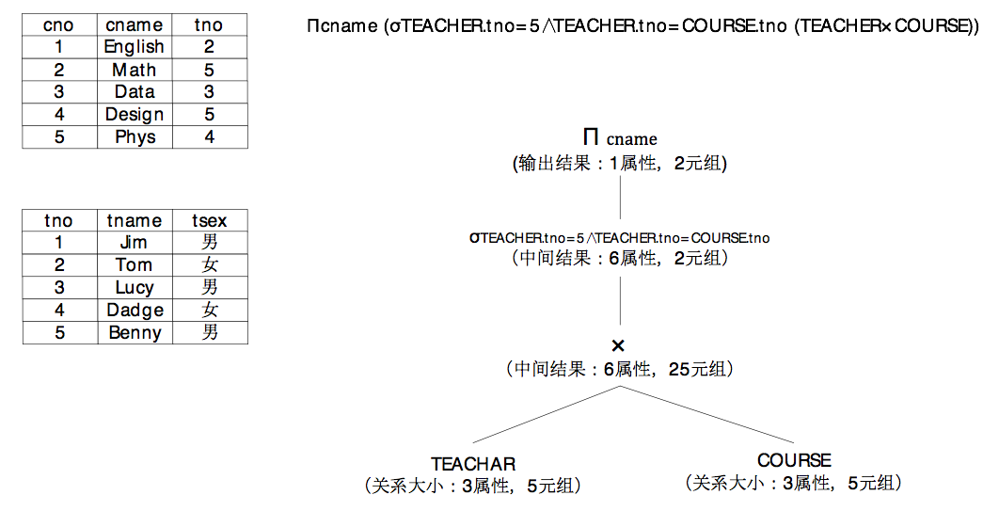

小明在大明家的书房里摆好了纸砚，在一份过期的报纸上挥毫泼墨：“精推细敲慎思量，雄关漫道两茫茫，夜半挑灯读诗酒，莫谈肉串与烤馕。”大明看了之后笑道：“好诗好诗，来，让我们继续夜半挑灯读优化，莫与扯淡诉衷肠。”

小明说：“再歇会吧，我觉得要深度了解查询优化没希望了。”大明看出了小明对查询优化产生了一点畏难情绪，因为小明本来以为通过大明的讲解能够快速的理解查询优化的本质，但是他通过几次听取大明的讲解之后发现，查询优化器远不是几次讲解就能解决的，大明目前给他讲解的还只是在应用层面的讲解，还没有深入到分析源码阶段，仅仅如此，对小明来说理解上就已经有些困难了，看来要想深度的了解查询优化器，还需要下更大的功夫才行。<!-- more -->
	
大明说：“啥叫成功？成功就是在你坚持不下去的时候再坚持一下，来吧，Let’s继续。”说着拉着小明来到客厅，继续打开了电脑，“我们继续说点啥呢？上次说到了子连接，这次我们简单说说选择下推和等价类吧。”

小明想了想说：“选择下推和等价类是逻辑分解优化中的内容了，可是逻辑重写优化里还有子查询提升、表达式预处理、外连接消除这些大块头你还没有给我讲解过吖。”

大明说：“这些先留给你自己去理解，如果理解不了再来找我吧。逻辑优化的规则实际上还是比较多的，但是是可以逐个击破的，也就是他们之间通常而言并没有多大的关联，我们不打算在这上面纠缠太多时间，我相信以你自己的能力把他们搞定是没有问题的。”

“哦，我觉得是你怕我在你家呆太长时间，把你吃穷吧？”小明偷笑着问。

“是的，半大小子吃死老子，你这饭桶太能吃了，吃饭的速度比选择下推的速度还要快，午饭都被你吃了，我今天中午都没吃饱啊。”

“我记得你说过，选择下推是为了尽早的过滤数据，这样就能在上层结点降低计算量，是吧？”

“是的。”大明点了点头，“还是通过一个关系代数的示例来说明一下它吧，顺便我们把等价类推理也可以说一说，比如说我们想要获得编号为5的老师承担的所有的课程名字，我们可以给出它的关系代数表达式。”说着大明在电脑上敲了一个关系代数表达式：

```
Πcname (σTEACHER.tno=5∧TEACHER.tno=COURSE.tno (TEACHER×COURSE))
```

“小明，你看这个关系代数表达式怎么下推选择操作？”

小明看着关系代数表达式思考了一会，说：“我看这个TEACHER.tno = 5比较可疑，你看这个关系代数表达式，先做了TEACHER×COURSE，也就是先做了卡氏积，我要是把TEACHER.tno = 5放到TEACHER上先把一些数据过滤掉，岂不是。。。完美！”说着小明也在电脑上敲出了把TEACHER.tno = 5下推之后的关系代数表达式。

```
Πcname (σTEACHER.tno=COURSE.tno (σTEACHER.tno=5(TEACHER)×COURSE))
```

大明说；“对的，你这样下推下来，的确能降低计算量，你这应用的是关系代数表达式中的分配率σF(A × B) == σF1(A) × σF2(B)，那你看看，既然下推这么好，是不是投影也能下推？”小明看了一下，关系代数表达式中值需要对cname进行投影，顿时想到了，COURSE表虽然有很多个列，但是我们只需要使用cname就够了嘛，于是小明在电脑上敲了投影下推的关系代数表达式。

```
Πcname (σTEACHER.tno=COURSE.tno (σTEACHER.tno=5(TEACHER)× Πcname(COURSE)))
```

大明拍了小明的头一下说：“笨蛋，你这样下推投影，TEACHER.tno=COURSE.tno还有办法做吗？”小明顿时领悟了，如果只在COURSE上对cname做投影时不行的，上层结点所有的表达式都需要考虑到，于是修改了表达式：

```
Πcname (σTEACHER.tno=COURSE.tno (σTEACHER.tno=5(TEACHER)× Πcname, tno(COURSE)))
```

“这还差不多。”大明笑着说：“这是使用的投影的串接率，也是一个非常重要的关系代数等价规则，目前我们对这个表达式的优化主要是使用了选择下推，和投影下推，如果用SQL语句来表示，就像这样。”大明在电脑的记事本上快速的打印出了两个SQL语句：

```
SELECT sname FROM TEACHER t, COURSE c WHERE t.tno = 5 AND t.tno = c.tno;
SELECT sname FROM (SELECT * FROM TEACHER WHERE tno = 5) tt, (SELECT cname, tno FROM COURSE) cc WHERE tt.tno = cc.tno;
```

“你看这两个语句，就是谓词下推和投影下推前后的对照语句。在做卡氏积之前，先做了过滤，这样笛卡尔积的计算量会变小。”
小明仔细的观察着代数表达式和这两个SQL语句，他发现一个问题，就是关系代数表达式中有TEACHER.tno = 5和TEACHER.tno = COURSE.tno这样的两个约束条件，这是不是意味着COURSE.tno也应该等于5呢？小明然后试着在电脑上写了一个SQL语句：

```
SELECT sname FROM (SELECT * FROM TEACHER WHERE tno = 5) tt, (SELECT cname, tno FROM COURSE WHERE tno=5) cc WHERE tt.tno = cc.tno;
```

然后小明说：“你看，由于有TEACHER.tno = 5和TEACHER.tno = COURSE.tno这样的两个约束条件，我们可以是不是可以推理出一个新的COURSE.tno = 5的新的约束条件来呢，这样我们还可以把这个条件下推到COURSE表上，这样也能降低笛卡尔积的计算量。”

大明说：“是的，这就是等价推理，PostgreSQL数据库在查询优化的过程中，会将约束条件中等价的部分都记录到等价类中，这样就能根据等价类生成新的约束条件出来，比如示例的语句中就会产生一个等价类{TEACHER.tno, COURSE.tno, 5}，这是一个含有常量的等价类，是查询优化器比较喜欢的等价类，这种等价类可以得到列属性和常量组合成的约束条件，通常都是能下推的。”

小明心里很高兴，自己通过仔细观察，得到了等价类的优化，感觉自己有了学习的动力，心里美滋滋的，然后就问大明：“那上面的SQL语句还有什么可优化的吗？”

大明观察了一下这个语句，然后说：“你看，我们已经在TEACHER表上进行了TEACHER.tno = 5的过滤，在COURSE表上也做了COURSE.tno = 5的过滤，这样就说明在做笛卡尔积的时候，实际上已经确定了TEACHER.tno = COURSE.tno = 5，也就是说TEACHER.tno = COURSE.tno这个约束条件已经隐含成立了，也就没什么用了，我们可以把它去掉，最终形成一个这样的SQL语句。”大明在记事本中敲下了最终的语句：

```
SELECT sname FROM (SELECT * FROM TEACHER WHERE tno = 5) tt, (SELECT cname, tno FROM COURSE WHERE tno=5) cc；
```

同时也敲出了这个语句对应的关系代数表达式：

```
Πcname (σTEACHER.tno=5(TEACHER)× Πcname, tno(σCOURSE.tno=5(COURSE)))
```

然后大明说：“经过选择下推、投影下推和等价类推理，我们对这个SQL语句或者说关系代数表达式进行了优化，最终降低了计算量。”
 
 

 
 

小明感觉对谓词下推已经理解了，然后说：“看上去也不复杂嘛，我发现了可以下推的选择我就下推，完全没有问题啊。”大明笑着说：“甚矣，我从未见过如此厚颜无耻之人，我们现在看的这个例子，只不过是最简单的一种情况啊，你就这样大言不惭，你的人生字典里还有羞耻二字吗？”

小明愤愤的说：“我的人生没有字典。。。”

大明问道：“我们这个例子有一个问题，就是他是内连接，因此我们可以肆意妄为的将选择下推下来，可以没羞没臊的做等价类推理，但是如果是外连接，那还能这么做吗？”

小明顿时陷入了苦苦的沉思。
