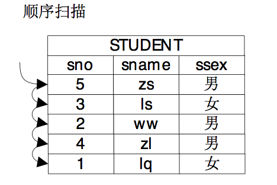
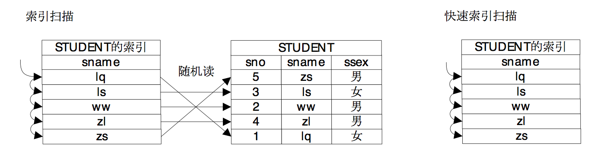
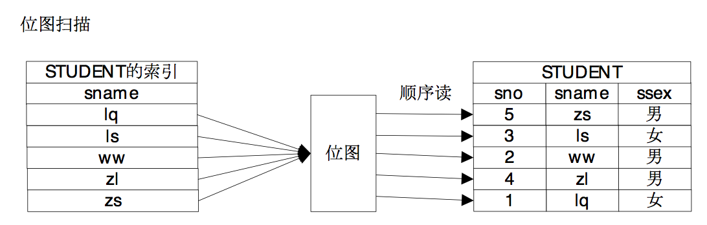
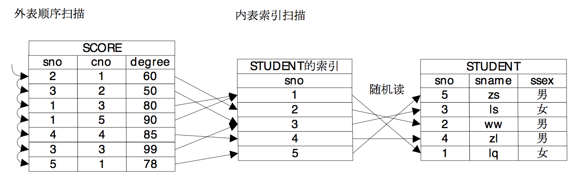
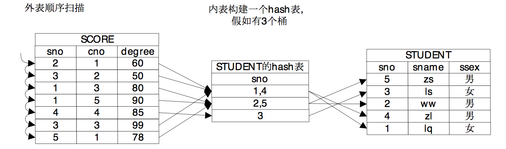
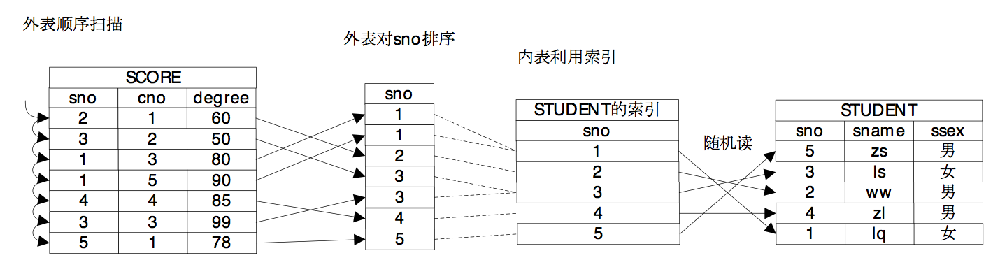

小明“摇醒”了晕倒的大明和牛二哥，然后说：“趁着大腰子和红酒还没送到，不如给我说说物理路径吧，虽然我们代价计算来计算去，最终还是为物理路径计算代价嘛。”

大明愤怒的说：“讲物理路径可以，不过你如果再这么吹嘘自己，咱俩就势不两立，你走你的阳关道，我过我的独木桥。”

牛二哥笑着说：“我看还是先算算走阳关道合算还是走独木桥合算吧，同样一件事，既可以走阳关道，也可以走独木桥，所谓殊途同归于尽嘛，不过我们还是得知道哪一个适合自己。”<!-- more -->

小明说：“大明和我说过这些阳关道和独木桥，它大体上分成扫描路径和连接路径，我查过一些查询优化器的说明，我知道扫描路径有顺序扫描路径、索引扫描路径、位图扫描路径等等，而连接路径通常有嵌套循环连接路径、哈希连接路径、归并连接路径，另外还有一些其他的路径，比如排序路径、物化路径等等。”

牛二哥说：“是的，我们就来说说这些路径的含义吧。如果要获得一个表中的数据，最基础的方法就是将表中的所有的数据都遍历一遍，从中挑选出符合条件的数据，这种方式就是顺序扫描路径，顺序扫描路径的优点是其具有广泛的适用性，各种表都可以用这种方法，它缺点自然是代价通常比较高，因为要把所有的数据都遍历一遍。”大明趁着牛二哥说顺序扫描路径的时候，在纸上画了个图，说：“这个图大概就是顺序扫描路径。”

 

牛二哥则继续说：“如果将数据做一些预处理，比如建立一个索引，如果要想获得一个表的数据，可以通过扫描索引获得所需数据的“地址”，然后通过地址将需要的数据获取出来，尤其是在选择操作带有约束条件的情况下，在索引和约束条件共同的作用下，表中的有些数据就不用再遍历了，因为通过索引就很容易知道这些数据是不符合约束条件的，更有甚者，因为索引上也保存了数据，它的数据和关系中的数据是一致的，因此如果索引上的数据就能满足要求，就只需要扫描索引就可以获得所需的数据了，也就是说在扫描路径中还可以有索引扫描路径和快速索引扫描路径两种方式。”

大明则继续为牛二哥“捧哏”，在纸上画上了索引扫描和快速索引扫描的图。

 
 
小明看到大明特意在图里写上了“随机读”三个字，于是问道：“我看这个索引扫描有随机读的问题，这个问题能否把它解决掉呢？也就是说即利用了索引，还避免了随机读的问题，有这样的办法吗？”

牛二哥说：“索引扫描路径确实带来随机读的问题，因为索引中记录的是数据元组的地址，索引扫描是通过扫描索引获得元组地址，然后通过元组地址访问数据，索引中保存的“有序”的地址，到数据中就可能是随机的了，位图扫描就能解决这个问题，它通过位图将地址保存起来，把地址收集起来之后，然后让地址变得有序，这样就通过中间的位图把随机读消解掉了。”大明则继续在纸上画上了位图扫描的示意图。

 
 
不过大明不甘心一直“站在桌子里面”，也想“站到桌子外面”承担一下“逗哏”的角色，于是说道：“扫描的过程中还会结合一些特殊的情况有一些非常高效的扫描路径，比如TID扫描路径，TID实际上是元组在磁盘上的存储地址，我们能够根据TID直接就获得元组，这样查询的效率就非常高了。”

牛二哥点了点头继续说到：“扫描路径通常是执行计划中的叶子结点，也就是在最底层对表进行扫描的结点，扫描路径就是为连接路径做准备的，扫描出来的数据就可以给连接路径来实现连接操作了。”

大明一边在纸上画一边说道：“要对两个关系做连接，受笛卡尔积的启发，可以用一个算法复杂度是O(mn)的方法来实现，我们叫它Nestlooped Join方法，这种方法虽然复杂度比较高，但是和顺序扫描一样，胜在具有普适性。”

牛二哥说：“嵌套循环连接这种方法的复杂度比较高，看上去没什么意义，但是如果Nestlooped Join的内表的路径是一个索引扫描路径，那么算法的复杂度就会降下来，索引扫描的算法复杂度是O(logn)，因此如果Nestlooped Join的内表是一个索引扫描，它的整体的算法复杂度就变成了O(mlogn)，看上去这样也是可以接受的。”

 

小明点了点头说：“嗯，索引实际上是对数据做了一些预处理，我想如果哈希连接方法就是将内表做一个哈希表，这样也等于将内表的数据做了预处理，也能方便外表的元组在里面探测吧？”

牛二哥点了点头说：“假设Hash表有N个桶，内表数据均匀的分布在各个桶中，那么Hash Join的时间复杂度就是O(m * n /N)，当然，这里我们没有考虑上建立Hash表的代价。”

大明则在纸上画出了Hash连接的示意图，并且补充道：“Hash连接通常只能用来做等值判断。”

 
 
牛二哥继续说：“如果将两个表先排序，那么就可以引入第三种连接方式，Merge Join，这种连接方式的代价主要浪费在排序上，如果两个关系的数据量都比较小，那么排序的代价是可控的，MergeJoin就是适用的，另外如果关系上有有序的索引，那么就可以不用单独排序了，这样也比较适用于MergeJoin。你看我画的这个归并连接的示意图，外表是需要排序的，而内表则借用了原有的索引的顺序，消除了排序的时间，降低了物理路径的代价。”

 
 
“这些路径属于SPJ路径，在PostgreSQL的优化器中，通常会先生成SPJ的路径，然后在这基础上再叠加Non-SPJ的路径，比如说聚集操作、排序操作、limit操作、分组操作。。。。”牛二哥继续补充道。

“咚咚咚，咚咚咚”敲门声响了，吃了吗外卖东来了三个人最爱的大腰子，吃大腰子的感觉完全停不下来，至于优化器。。。先让它见鬼去吧。
