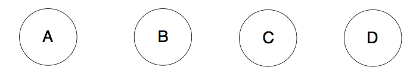
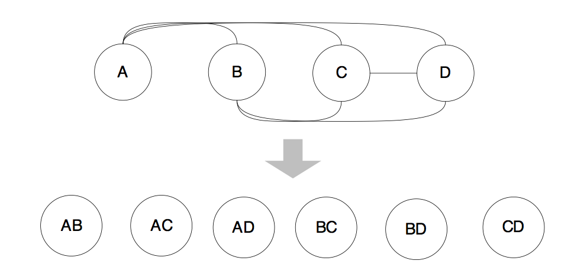
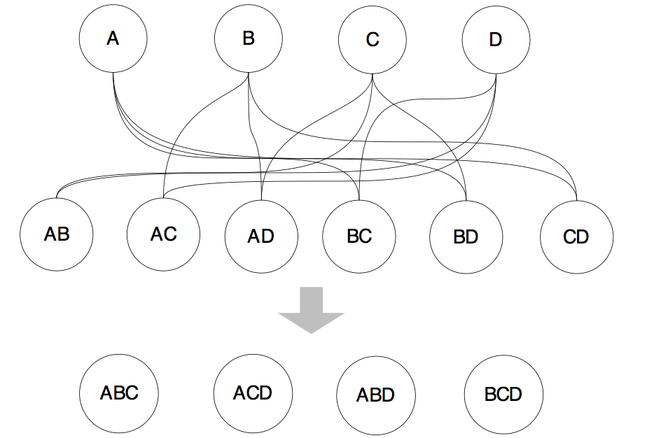
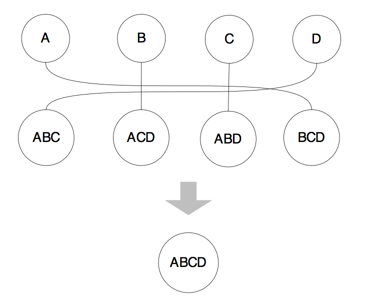

小明、大明和牛二哥在大坑点评里搜索附近好的饭店，搜来搜去总是感觉不太靠谱，不是卫生有问题，就是味道不够正宗，大明感叹道：“看，这就是蓝海，我们可以创业搞一个AI点评，只能推荐最优的饭店啊，我准确的找到了吃货们的痛点，这里面隐含着很大的商机啊！”

牛二哥瞥了它一眼说：“AI推荐当然好啊，可是要推荐的准才行啊，可是一个人一个口味，你这个需求太‘智能’了，我估计不好弄。”

小明突然想到自己最近在学校的算法课上老师讲过一些求最优解问题的方法，然后说：“我知道，我知道，我最近在算法课上学过一些最优解问题的解决方法，应该可以用得上。”

<!-- more -->

牛二哥叹口气道：“可是这些方法用到优化器里都不一定够用，何况用到一个更加智能的项目上呢？”

“嗯？优化器里也用到了最优解问题的方法了吗？我们学过动态规划、贪心算法。。。”小明如数家珍的说起来。

大明说：“用到了啊， 虽然物理路径看上去也不多，但实际上枚举起来，它的搜索空间也不小。例如在扫描路径中，我们就可以有顺序扫描、索引扫描和位图扫描，假如一个表上有多个索引，那么就可能产生多个不同的索引扫描，那么哪个索引扫描路径好呢？而索引扫描和顺序扫描、位图扫描相比，哪个好呢？”

大明看着小明迷离的眼神，停顿了一下，给他足够的思考空间之后继续说道：“数据库路径的搜索方法通常有3种类型：自底向上方法、自顶向下方法、随机方法，而PostgreSQL采用了其中的两种方法呢。”

“采用了哪两种方法呢？”牛二哥明知故问道。

“采用了自底向上的方法和随机方法，其中自底向上的方法是采用的动态规划方法，而随机方法采用的是遗传算法。”

“那有谁使用了自顶向下的方法呢？”牛二哥继续“捧哏”道。

“嗯。。。这个嘛，Pivotal公司的开源优化器ORCA用的就是自顶向下的方法。可以让牛二先给你说说怎么样用动态规划方法搜索最优物理路径。”

牛二哥拿出纸来，在纸上画了几个圈，然后说：“这代表4个表，自底向上嘛，所以是从底下向上堆积，这是最底层，我们叫它第一层”。

 

“动态规划方法首先考虑两个表的连接，其中优先考虑有连接关系的表进行连接，两个表的连接可以建立一个新的表，我们把这些新表叫做第二层。”牛二哥通过连线，产生了一些新的“表”。

 

“第二层的表和第一层的表再连接，可以生成基于3个表连接的新的‘表’，这样就又向前推进了一层，我们产生了第三层”

 
 
“然后再用第三层的表和第一层的表进行连接，最终生成整个问题的最优路径。”

 
 
“可是，这不就是穷举吗？”小明问道。

牛二哥解释说：“动态规划有两个特点，一个是要重复的利用子问题的解，这样能减少计算量，降低复杂度，另外一点就是通过子问题的最优解能够构造出最终的最优解，也就是说需要具有最优子结构的性质，所以动态规划的复杂度和穷举是不一样的。”

大明继续解释说：“还有，虽然你看图里的连线比较多，但在实际情况里，并不是所有的圈圈之间都能产生连线，连接关系也有个合法性的问题嘛，所以复杂度是可以控制住的。”

小明感觉好像明白了一点，然后赶紧追问：“那遗传算法呢？”

大明说：“虽然动态规划的复杂度是可以控制的，但是如果表比较多，它的搜索空间还是很大，所以如果在表比较多的时候，可以尝试使遗传算法，这个算法获得的不一定是全局最优解，它获得的可能是局部最优解。”

“那遗传算法是怎么实现物理路径搜索的呢？”小明问。

牛二哥去大明的书柜里找到了一本算法的书，恰好里面有遗传算法的介绍，于是朗读了起来：“遗传算法的实现步骤如下：1）种群初始化：对基因进行编码，并通过对基因进行随机的排列组合，生成多个染色体，这些染色体构成一个新的种群，另外，在生成染色体的过程中同时计算染色体的适应度；2）选择染色体：通过随机选择（实际上通过基于概率的随机数生成算法，这样能倾向于选择出优秀的染色体），选择出用于交叉和变异的染色体；3）交叉操作：染色体进行交叉，产生新的染色体并加入到种群；4）变异操作：对染色体进行变异操作，产生新的染色体并加入到种群；5）适应度计算：对不良的染色体进行淘汰。”

大明笑着说：“尽信书不如无书，我来说一下遗传算法是如何解决货郎问题的。我们可以将城市作为基因，走遍各个城市的路径作为染色体，路径的总长度作为适应度，适应度函数负责筛选掉比较长的路径，保留较短的路径，算法的步骤如下：1）对各个城市进行编号，将各个城市根据编号进行排列组合，生成多条新的路径（染色体），然后根据各城市间的距离计算整体路径长度（适应度），多条新路径构成一个种群；2）选择两个路径进行交叉（需要注意交叉生成新染色体中不能重复出现同一个城市），对交叉操作产生的新路径计算路径长度；3）随机选择染色体进行变异（通常方法是交换城市在路径中的位置），对变异操作后的新路径计算路径长度；4）对种群中所有路径进行基于路径长度有小到大排序，淘汰掉排名靠后的路径。”大明一口气说完了整个流程，长出了一口气，然后继续说：“怎么样，是不是so easy?”

小明想了想牛二哥和大明说的流程，然后说，“我来猜想一下PostgreSQL是如何实现遗传算法的，PostgreSQL应该是模拟了解决货郎问题的方法，它将表作为基因、最终生成的执行计划作为染色体、执行计划的总代价作为适应度，适应度函数则是基于路径的代价进行筛选，对不对？”

牛二哥赞叹道：“说得非常好，不过需 PostgreSQL数据库的基因算法实现方式和通常的遗传算法略有不同在于其没有变异的过程，只通过交叉产生新的染色体，不过这都不是重点了。”

大明说：“哎哎哎，我们不是在搜索饭店吗，怎么搜索起来最优路径了？不要再说优化器了，再晚点饭都没得吃了。”
于是三个人又热火朝天的搜起饭店来了。

