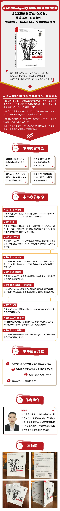

[京东地址](https://item.jd.com/12898593.html)  
[当当地址](http://product.dangdang.com/29277465.html)  
[淘宝地址](https://detail.tmall.com/item.htm?spm=a1z10.3-b-s.w4011-22119638442.37.798d1b8b6TlJDS&id=651820819927&rn=215b8c029b06d654c30a5777273c979e&abbucket=1) 

 

<!--more-->

**为什么写这本书？**

近年来，我一直从事与PostgreSQL相关的数据库内核开发工作，主攻方向是SQL引擎中的查询优化，对事务的了解仅停留在理论层面，虽然对事务的性质、隔离级别也能讲一番大道理，但终究华而不实，于探究事务的本质无益。所谓“纸上得来终觉浅，绝知此事要躬行”，在完成了《PostgreSQL技术内幕：查询优化深度探索》一书之后，我就开始了事务的探索之旅。

探索的过程并非一帆风顺。事务的理论已经颇为复杂，在形成源代码之后更是有数十万行之多，对这些源代码做逐行分析的工作量非常大，一旦遇到不解的问题，还需查阅资料、翻阅讨论组中的邮件。入之愈深，其进愈难，则其见愈奇。以前根据事务理论想当然的一些理解会被具体实现中的精巧设计打破，而对这些设计细节的深刻理解能帮助我们快速地解决工作中遇到的问题，因此，我又产生了写第二本书的想法，希望对自己在探索过程中遇到的知识点做一个总结与分享。

**为什么阅读这本书？**

事务是关系数据库中最重要的内容之一，无论是对数据库内核进行开发，还是在数据库的基础上进行应用程序的开发，都需要对事务有深入的了解。本书细致地解读了PostgreSQL 数据库中与事务相关的大部分源码，对其中比较重要的理论给出了说明，相信已经足以让读者了解PostgreSQL中事务的全貌。

**本书的组织结构**

本书在章节的排布上可以分为两个部分：

•基础篇（第1~4章）：主要介绍了事务的基本概念、并发控制的实现方法和故障恢复的实现方法；

•进阶篇（第5~9章）：在事务理论的基础上，对物理复制、逻辑复制、SSI实现、新型Zheap引擎、2PC做了深入的解读。

由于事务引擎和存储引擎关系密切，本书在附录中对存储引擎的一些知识点也做了相关介绍，方便读者加深理解。

**纠错**

在写作的过程中，我尝试尽量多地查阅相关资料，但限于作者的能力，书中难免出现一些错误，欢迎广大读者对本书提出批评和意见，这也有益于作者本身能力的提升。

**致谢**

孟庆钟博士和周兆琦博士通过视频会议的方式逐字逐句地审阅了书稿，多次批改书稿到深夜，提出了很多有益的意见，感谢二位辛苦的付出。

本书是第二次和董英编辑合作，得到了董英编辑的大力支持，在此表示感谢。
  
李秀梅编辑是本书的责任编辑，在书稿写作过程中，秀梅编辑不厌其烦地解答了我很多问题，对我的拖稿行为也给予了极大的理解，感谢秀梅编辑。

感谢我的父母、妻子，书稿的创作过程枯燥而冗长，占用了很多生活的时间，他们承担了所有的家务，为我提供了最好的写作环境。

我的两个儿子也非常关心我的写作进度，经常询问我什么时候完成创作，并在我创作的过程中纠正了一些错别字，在此一并表示感谢。

